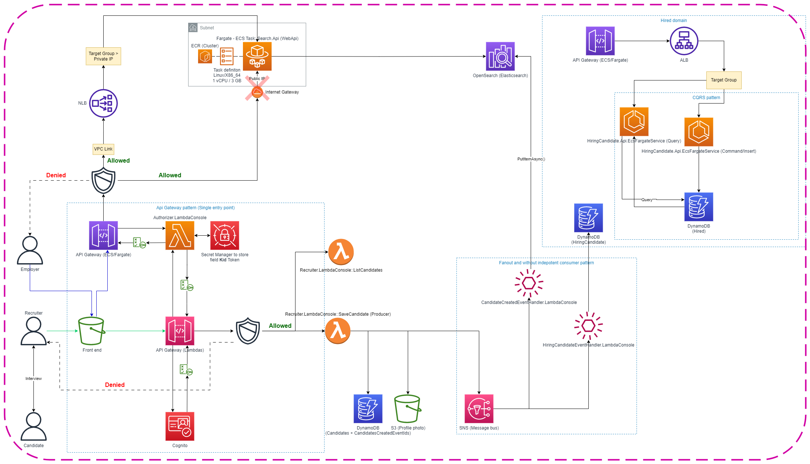

# TO DO

- Frontend
  - Image uploaded into s3 is broken
  - List candidates
  - Auth guard
- Create default user admin...
- Change the AdminGroup to Admin... in cognito and lambda code
- Cloudformation...
- Resolve this... https://stackoverflow.com/questions/61012712/amazon-http-api-gateway-not-working-via-vpc-link
