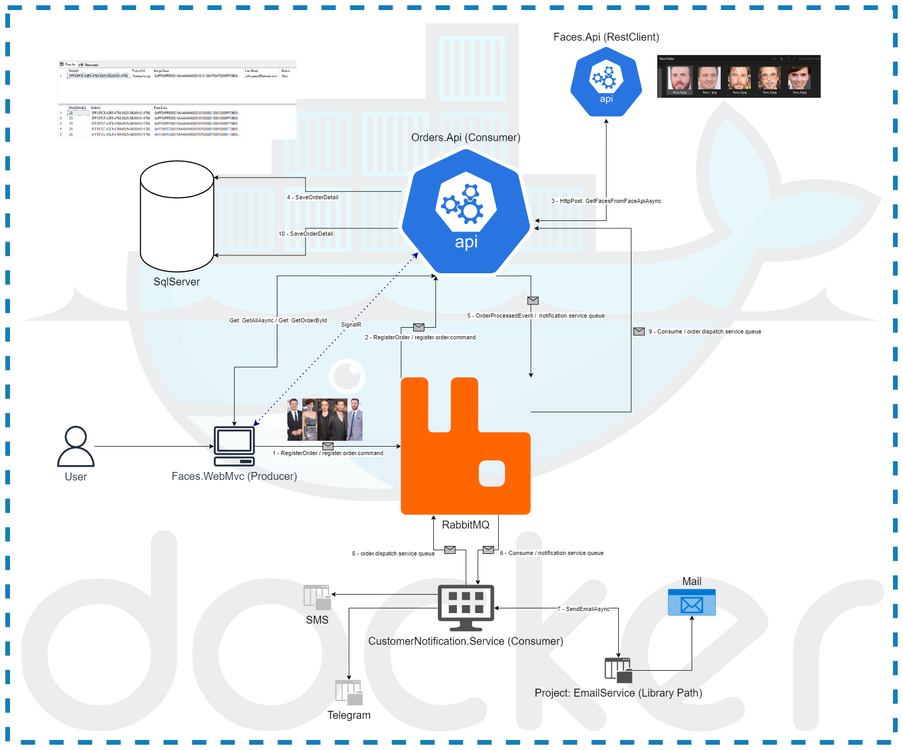

# Project Face Detection <!-- omit in toc -->

## Contents <!-- omit in toc -->

- [1. What is this project](#1-what-is-this-project)
- [2. How is it organized](#2-how-is-it-organized)
  - [2.1. Others services](#21-others-services)

# 1. What is this project

- This is a project that shows the communication between microservices with their respective responsabilities using the event-drive architecture in a Docker container.

# 2. How is it organized

| Project                        | Responsabilitie                                     | Framework      | Type     | Port (http) |
| ------------------------------ | --------------------------------------------------- | -------------- | -------- | ----------- |
| Faces.API                      | Process the event (image)                           | net6.0         | webapi   | 6000        |
| Faces.API.Test                 | Test the Faces.API project                          | net7.0         | console  | XXXX        |
| Faces.WebMvc                   | customer interface                                  | net7.0         | webapp   | 4000        |
| Messaging.Interfaces.SharedLib | constants and contracts                             | netstandard2.1 | classlib | XXXX        |
| Orders.Api                     | Send the processed image to the database            | net5.0         | webapi   | 5000        |
| CustomerNotification.Service   | Notify the client that the event has been processed | net7.0         | console  | XXXX        |

## 2.1. Others services

- RabbitMQ
- SQLServer
- https://github.com/shimat/opencvsharp/tree/master/docker
