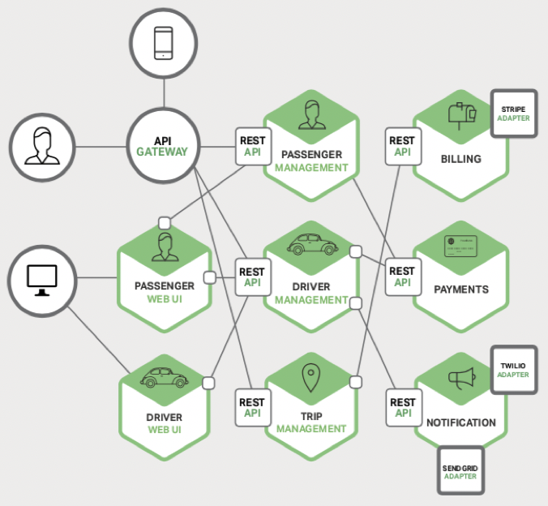

# Microservices architecture overview <!-- omit in toc -->

## Contents <!-- omit in toc -->

- [1. What are Microservices?](#1-what-are-microservices)
  - [1.1. Characteristics](#11-characteristics)
- [2. Monolithic architecture](#2-monolithic-architecture)
  - [2.1. Advantages](#21-advantages)
  - [2.2. Disadvantages](#22-disadvantages)
- [3. Microservices architecture](#3-microservices-architecture)
  - [3.1. Advantages](#31-advantages)
  - [3.2. Disadvantages](#32-disadvantages)
- [4. Deployment](#4-deployment)
- [5. Docker](#5-docker)
- [6. Patters](#6-patters)
  - [6.1. Sidecar](#61-sidecar)

# 1. What are Microservices?

- Microservice are small business services that can work together and can be deployed autonomously and independently.
- These services communicate with each other by talking over the network and bring many advantages.
- One of the biggest advantages is that they can be deployed independently.
  - However, it offers the opportunity to work with many different technologies, **technology agnostic**.

## 1.1. Characteristics

- So if look at the microservices characteristics, will see that **Microservices** are:
  - Small
  - Independent
  - Loosely coupled.
  - A single small team of developers can write and maintain a service.
  - Each service is a separate codebase, which can be managed by a small development team.
  - Services can be deployed independently.
  - A team can update an existing service without rebuilding and redeploying the entire application.
  - Services are responsible for persisting their own data or external state.
  - This differs from the traditional model, where a separate data layer handles data persistence.
    - And Services communicate with each other by using well-defined APIs.
    - Internal implementation details of each service are hidden from other services.
- **Services don't need to share the same technology stack, libraries, or frameworks.**

# 2. Monolithic architecture

- A monolithic application has a **single codebase** that contains multiple modules.
- Modules are divided according to their functional or technical characteristics.
- It has a single build system that builds the entire application.
- It also has a single executable or deployable file.

## 2.1. Advantages

- It is easier debugging and end-to-end testing.
- Unlike the Microservice architecture, monolithic applications are much easier to debug and test.
- It is easy to develop and maintain for small projects.
- Application can be developed quickly.
- It is easy to perform test operations, you can perform end-to-end tests much faster.
- And it is much easy deployment.
- Also transaction management.
- It is very easy when we are talking about the monolithic architecture.

## 2.2. Disadvantages

- Complexity, when a monolithic application grows, it becomes too complex to understand. As the application grows, it becomes difficult to develop new features and maintain existing code.
- With the increase in the number of teams and employees working on the project, development and maintenance becomes more difficult.
- Because of their dependencies on each other, changes made in one functionality can affect other places.
- And another weakness is the challenge of making changes, making a new changes is very cumbersome in such a large and complex application.
- Any code change affects the entire system, so all parts must be thoroughly checked.
- This can make the overall development process much longer.
- Even with a small change in the application, the entire application must be deploy.
- We can say that inability to apply new technology,
- Implementing a new technology in a monolithic application is extremely problematic.
- The same programming language and same frameworks must be used.
- Integrating the application into a new technology means redeveloping the whole application.
- Is low scaleable, you cannot scale components independently, you have to scale the entire application.

# 3. Microservices architecture

- Microservice are small business services that can work together and can be deployed autonomously and independently.

## 3.1. Advantages

- Independent Services.
- Each service can be deployed and updated independently, providing more flexibility.
- Also, adding new features to a microservice application is easier than a monolithic one.
- Whether the application is very large or very small, adding new features and maintaining existing code is easy.
- Better scalability, each service can be scaled independently, therefore, the entire application does not need to be scaled.
  - This saves a lot of time and money.
- Additionally, every monolithic application has limits in terms of scalability.
- However, multiplexing a service with traffic on the microservice is less inconvenient and able to handle the whole load.
- This is why most projects that appeal to a large user base, have begun to adopt the microservice architecture.
- Technology Diversity, teams do not have to completely choose the technologies on which the services will be developed, they can choose the appropriate technology for the services they will develop over time.
  - For example, a microservice can be developed with the python programming language in order to use machine learning machine learning features next to microservices developed on .Net environment.
- The desired technology or database can be used for each microservice
- Higher level of agility, any errors in a microservice application only affect a particular service, not the entire application, therefore, all changes and tests are carried out with lower risks and fewer errors.
- Teams can work more efficiently and quickly.
- Folks who are just starting the project can easily adapt without getting lost in the code base.
- Intelligibility, a microservice application broken down into smaller and and simpler components is easier to understand and manage, since each service is independent from each other and only has its own business logic, the code base of the service will be quite simple.
- It is easier to understand and manage.

## 3.2. Disadvantages

- Microservice architecture should never be preferred for small-scale applications, because it becomes extra complexity.
- Since a microservice architecture is a distributed system, you need to configure each module and database separately.
- In addition, as long as such an application includes independent services, they must all be distributed independently.
- System distribution a microservice architecture is a complex system made up of multiple services and databases, so all connections need to be handled carefully. Deployment requires a separate process for each service.
- Challenge of management and traceability, you will need to deal with multiple situations when creating a microservice application. It is necessary to be able to monitor external configuration, metrics, health-check mechanisms and environments where microservices can be managed.
- Testing, the larger number of services deployed independently of each other makes the testing process extremely difficult. Because when you performed end-to-end test on the microservices you will see the several microservices is working on their environment.
- Since there are more than one service and more than one database, transaction management will be difficult.

# 4. Deployment

# 5. Docker

[Docker](https://github.com/jeftegoes/DockerOverviewAndCommands)

# 6. Patters

## 6.1. Sidecar

- A secondary container is deployed alongside the main container for added functionality.
- Normally the Sidecar performs cross-cutting concerns i.e., logging, monitoring, security etc.
- The Sidecar and the main container share the state i.e., file storage, database cache etc.
- One use of a Sidecar is to extend the functionality of a system (i.s., a microservice or monolithic application) without changing the code of the system, reducing the risk os breaking it.
